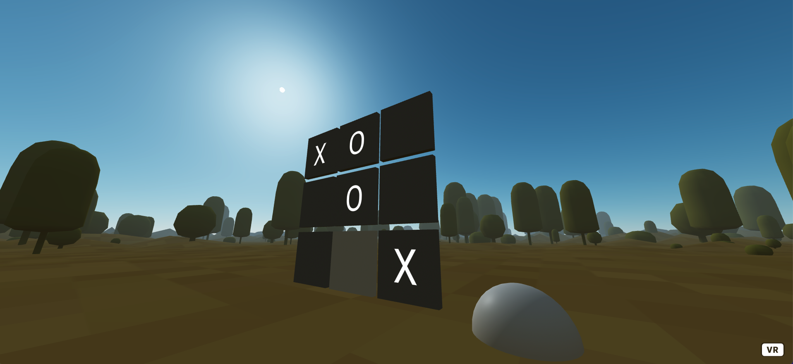
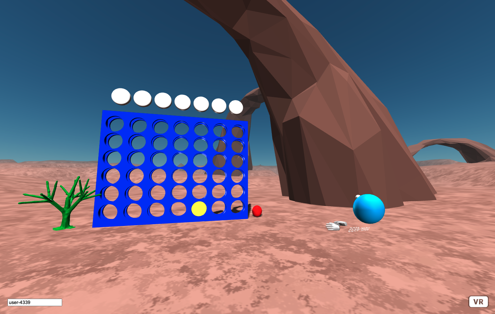

# @metapins/aframe-element

aframe-element is a library inspired from the very nice library [Polymer lit](https://lit.dev/) to map [A-Frame](https://aframe.io/) AR / VR / 3D elements on typescript classes like Angular/React/Lit.  
Used with [@metapins/lit-observable](https://github.com/metapins/lit-observable), you can create simple, fast and reactive WebXR 3D /AR and VR scenes with all modern web development good practices.

**[Get started !](./docs/get-started.md)**

## Installation

Use the package manager [npm](https://www.npmjs.com/package/@metapins/aframe-element) to install aframe-element.

```bash
npm install @metapins/aframe-element
```

## Usage

### By component

```typescript
import { customElement, AFrameElement } from '@metapins/aframe-element';

@customElement('my-3d-element')
exports My3dElement extends AFrameElement {
  render() {
    return html`
      <a-entity text="value: Hello World;"></a-entity>
    `;
  }
}
```

```html
<a-scene>
  <my-3d-element></my-3d-element>
</a-scene>
```

### With parameters

```typescript
import { customElement, AFrameElement } from '@metapins/aframe-element';

@customElement('my-text-element')
exports MyTextElement extends AFrameElement {
  static schema: {
    text: { type: 'string' },
  }

  render() {
    return html`
      <a-entity text="value: ${this.data.text};"></a-entity>
    `;
  }
}
```

```html
<a-scene>
  <a-my-text-element _text="Hello World"></a-my-text-element>
</a-scene>
```

### By attribute

```typescript
import { customElement, AFrameElement } from '@metapins/aframe-element';

@customElement('my-text-element')
exports MyTextElement extends AFrameElement {
  static schema: {
    text: { type: 'string' },
  }

  render() {
    return html`
      <a-entity text="value: ${this.data.text};"></a-entity>
    `;
  }
}
```

```html
<a-scene>
  <a-entity my-text-element="text: Hello World;"></a-entity>
</a-scene>
```

### With an aframe event

```typescript
import { customElement, AFrameElement } from '@metapins/aframe-element';

@customElement('my-3d-element')
exports My3dElement extends AFrameElement {
  init() {
    console.log('component initilized', this.el);
  }

  render() {
    return html`
      <a-entity text="value: Hello World;"></a-entity>
    `;
  }
}
```

```html
<a-scene>
  <my-3d-element></my-3d-element>
</a-scene>
```

# With @metapins/lit-observable and rxjs

```typescript
import { customElement, AFrameElement } from '@metapins/aframe-element';

@customElement('pawn')
export class PawnElement extends AFrameElement {
  private background$ = new BehaviorSubject<string>('grey');

  render() {
    return html`
      <a-box
        scale="1 1 0.1"
        material="color: ${observe(this.background$)}"
        @mouseenter=${() => this.background$.next('white')}
        @mouseleave=${() => this.background$.next('grey')}
      ></a-box>
    `;
  }
}
```

```html
<a-scene cursor="rayOrigin: mouse;  fuse: false;">
  <my-3d-element></my-3d-element>
</a-scene>
```

More information about @metapins/lit-observable [here](https://github.com/metapins/lit-observable)

## Documentation

- [Get started](./docs/get-started.md)

## Example

### Tictactoe with rxjs

- Demo: https://aframe-element-demo.herokuapp.com/
- Source code: https://github.com/metapins/aframe-element/blob/master/apps/demo/src/app/app.element.ts



### Puissance4 with network playing & @vaadin/router & redux

- Demo: https://puissance4-aframe.herokuapp.com/
- Source code: https://github.com/metapins/aframe-puissance4

The owner of the multiplayer game is the first to open the link (player yellow). Next users to open the demo are red.

_Tips: You can open 2 tabs on the same browser to test multiplayer mode._



## Contributing

Pull requests are welcome. For major changes, please open an issue first to discuss what you would like to change.

Please make sure to update tests as appropriate.

## License

[MIT](https://choosealicense.com/licenses/mit/)
