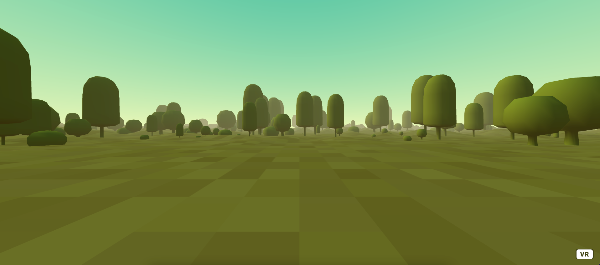
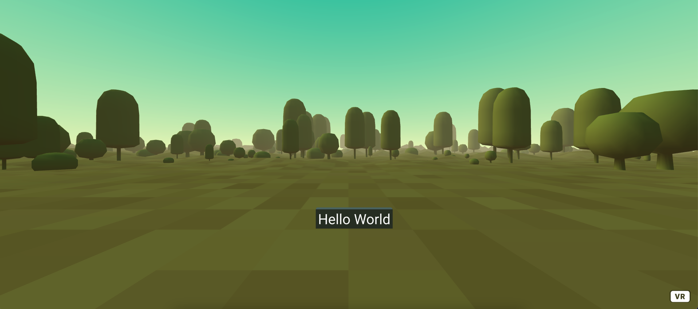

# Get started

## Project initialisation

To generate our project skeleton, we will use [nx](https://nx.dev/).

On a bash / DOS terminal, execute the following command:

```bash
$ npx create-nx-workspace helloworld --appName="helloWorld" --preset="web-components" --style="css" --nx-cloud=false
```

Open the created directory "helloworld" in your favorite IDE ([VisualStudio code](https://code.visualstudio.com/) ?)

## Start the development server

On a bash / DOS terminal, execute the following command in your project directory:

```bash
nx serve
```

Open `http://localhost:4200/` in your browser to see the result

## Add required library

On a bash / DOS terminal, execute the following command in your project directory:

```bash
npm install aframe aframe-environment-component @metapins/aframe-element lit
```

- [aframe](https://aframe.io/): wonderful 3D engine from HTML tags
- [aframe-environment-component](https://supermedium.com/aframe-environment-component/): default 3d environment
- [@metapins/aframe-element](https://github.com/metapins/aframe-element): create 3D web components
- [lit](https://lit.dev): required by @metapins/aframe-element

## Import required library in source code

In apps/web-components/src/app/app.element.ts  
replace

```typescript
import './app.element.css';
```

by

```typescript
import { AFrameElement, customElement } from '@metapins/aframe-element'; // used to create a 3d component
import 'aframe'; // main 3d engine
import 'aframe-environment-component'; // default 3d environment
import { html } from 'lit'; // used to generate reactive html
```

## Create an empty 3d scene

In apps/web-components/src/app/app.element.ts  
replace

```typescript
connectedCallback() {
    this.innerHTML = `
      ...
    `;
  }
```

by

```typescript
connectedCallback() {
    this.innerHTML = `
      <a-scene>
        <a-entity environment="preset: forest"></a-entity>
        <a-hello-world></a-hello-world>
      </a-scene>
    `;
  }
```

The following line is optionnal but display a beautiful 3d environment:

```typescript
<a-entity environment="preset: forest"></a-entity>
```

The following line display our amazing custom component, but who doesn't exist yet:

```typescript
<a-hello-world></a-hello-world>
```

Actually, if your `nx server` is running, you can go back on your browser on `http://localhost:4200/` and see the result. You must see a beautiful forest, our default 3d environment.


## Add our custom HelloWorld component

In apps/web-components/src/app/app.element.ts  
add the following code at end of the file

```typescript
@customElement('hello-world')
export class HelloWorldElement extends AFrameElement {
  render() {
    return html`
      <a-box
        material="color: grey;"
        position="0.090 0.5 -3.05"
        scale="1.2 0.3 0.1"
      ></a-box>
      <a-text value="Hello World" position="-0.5 0.5 -3"></a-text>
    `;
  }
}
```

Our element display the text "Hello world" on a grey box in our environment.


**Congratulation, you created your first aframe-element scene compatible VR / 3D.**

demo online: 
https://aframe-element-get-started.herokuapp.com

source code: 
https://github.com/metapins/aframe-element-examples/tree/get-started

